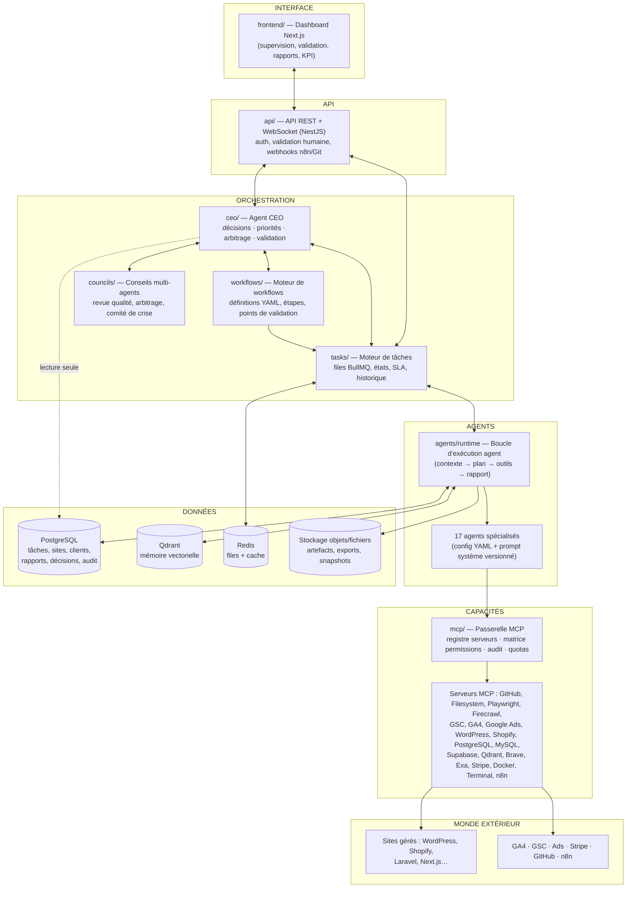
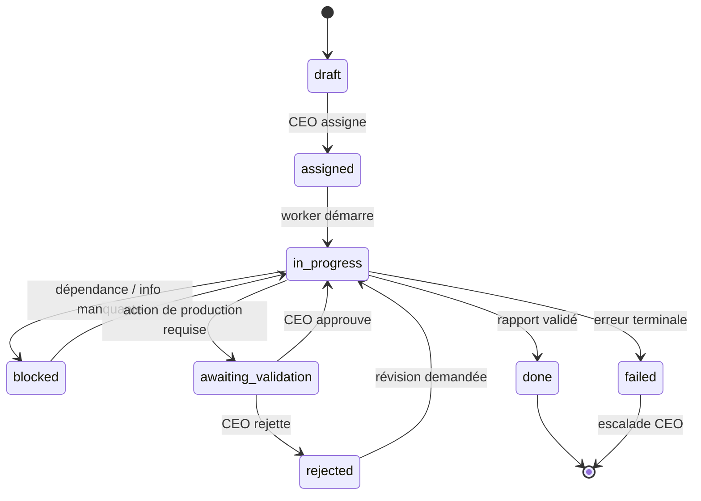

# 01 — Architecture complète

> Document de référence. Tout choix de conception qui contredit ce document
> doit être arbitré et tracé dans `data/decisions/` avant d'être appliqué.

---

## 1. Vision

Agency AI OS est un **système d'exploitation d'entreprise IA** : une agence
digitale virtuelle où des agents IA spécialisés collaborent pour gérer un
portefeuille de sites web — SEO, contenu, développement, conversion, marketing,
ventes, sécurité — sous l'autorité d'un agent CEO qui décide et valide, mais
n'exécute jamais.

Ce n'est **pas** un chatbot : c'est une organisation, avec une hiérarchie, des
processus, une mémoire institutionnelle, des contrôles et des indicateurs.

### Principes directeurs

| # | Principe | Conséquence architecturale |
|---|----------|---------------------------|
| P1 | Le CEO décide, ne fait pas | Le CEO n'a aucun accès MCP d'écriture vers les sites |
| P2 | Validation avant action | Toute action de production passe par `awaiting_validation` sauf autonomie déléguée explicite |
| P3 | Moindre privilège | Matrice MCP par agent, appliquée par la passerelle MCP (code, pas prompt) |
| P4 | Un seul format de rapport | Schéma `Report` unique validé par Zod à la soumission |
| P5 | Tout est tracé | Journal d'audit append-only : tâches, messages, appels MCP, décisions |
| P6 | Multi-sites natif | Aucune donnée globale mutable : tout est partitionné par `site_id` / `client_id` |
| P7 | Évolutif sans refonte | Workers stateless + files de tâches : 1 → 100 → 1000 sites = ajout de workers |
| P8 | Code SOLID, testable, documenté | Monorepo modulaire, injection de dépendances, contrats d'interface, tests par package |

---

## 2. Vue d'ensemble



Le détail des échanges est spécifié dans
[04-interactions.md](04-interactions.md) et [05-flux-de-donnees.md](05-flux-de-donnees.md).

---

## 3. Les couches

### 3.1 Interface — `frontend/`

Dashboard Next.js (App Router) pour l'opérateur humain :

- **Cockpit** : vue portefeuille (sites, santé, KPI, alertes).
- **File de validation** : décisions en attente (le CEO peut escalader à l'humain ;
  l'humain peut reprendre la main sur toute validation CEO).
- **Tâches** : kanban temps réel (WebSocket) par site / client / agent.
- **Rapports** : consultation, comparaison avant/après, export.
- **Agents** : état, historique, KPI, consommation (tokens, coûts), kill switch par agent.
- **Mémoire** : exploration de la mémoire vectorielle et des décisions.

### 3.2 API — `api/`

API NestJS (REST + WebSocket) :

- Authentification/autorisation des humains (RBAC : admin, opérateur, client-lecture).
- Endpoints CRUD : sites, clients, tâches, workflows, agents (config), rapports.
- Endpoints de gouvernance : valider/rejeter, pause/kill switch, quotas.
- Webhooks entrants : GitHub (CI, PR), n8n, Stripe, alertes uptime.
- Flux temps réel : événements de tâches et de messages vers le dashboard.

L'API ne contient **aucune logique métier** : elle appelle les packages du domaine
(`tasks/`, `ceo/`, `reports/`…). Règle SOLID : dépendances orientées vers le domaine.

### 3.3 Orchestration — `ceo/`, `tasks/`, `workflows/`, `councils/`

Le cœur du système. Voir §5 à §8.

### 3.4 Agents — `agents/`

Un **runtime unique** (boucle d'exécution générique) + **une définition par agent**
(YAML + prompt système). Ajouter un agent = ajouter une définition, zéro code
nouveau dans le runtime. Voir §6.

### 3.5 Capacités — `mcp/`

La passerelle MCP est le **seul** chemin entre un agent et le monde extérieur.
Voir §9.

### 3.6 Données — `database/`, `memory/`

- **PostgreSQL** : source de vérité transactionnelle (tâches, sites, clients,
  rapports, décisions, audit, config agents).
- **Qdrant** : mémoire vectorielle (collections partitionnées, voir §8).
- **Redis** : files BullMQ, verrous, cache court terme.
- **Stockage fichiers** : artefacts volumineux (exports Lighthouse, captures
  Playwright, snapshots de pages, briefs).

---

## 4. Stack technique

| Composant | Choix | Justification |
|-----------|-------|---------------|
| Langage | TypeScript (Node.js ≥ 22) | Un seul langage partout ; meilleur écosystème MCP (`@modelcontextprotocol/sdk`) ; typage des contrats |
| Monorepo | pnpm workspaces + Turborepo | Packages isolés, builds incrémentaux, publication par module |
| LLM | API Claude (Agent SDK) | Boucle agentique native, tool-use, MCP ; modèle paramétrable par agent (raisonnement lourd pour CEO/Developer, modèle rapide pour tâches mécaniques) |
| API backend | NestJS | Modules + injection de dépendances = SOLID par construction ; testabilité |
| Frontend | Next.js 15 + Tailwind + shadcn/ui | Dashboard réactif, SSR, écosystème mature |
| Base de données | PostgreSQL 16 + Drizzle ORM | Fiabilité, partitionnement par site, migrations SQL versionnées, typage strict |
| Vecteurs | Qdrant | Filtrage par payload (site/client/agent), collections nommées, scalable |
| Files & jobs | Redis + BullMQ | Priorités, retries, rate-limit par site, workers horizontaux |
| Validation de schémas | Zod (source unique dans `shared/`) | Un seul contrat pour API, agents, DB et docs |
| Workflows externes | n8n | Intégrations sans code (alertes, e-mails, CRM) déclenchées par webhooks |
| Conteneurs | Docker + docker-compose | Dev reproductible ; workers scalables ; sandbox d'exécution pour Developer/Security |
| Tests | Vitest + Playwright + Testcontainers | Unitaires par package, E2E sur workflows, DB/queues réelles en test |
| Observabilité | OpenTelemetry + Grafana/Loki | Traces par tâche, logs corrélés `task_id`, coût LLM par agent/site |

---

## 5. Le CEO

Le CEO est un agent LLM avec un rôle **exclusivement décisionnel**.

**Entrées** : objectifs des clients, KPI des sites, rapports des agents,
alertes, demandes de validation, conflits.
**Sorties** : tâches assignées, priorités, décisions de validation
(approve/reject/demande de révision), demandes de rapport, escalades à l'humain.

### 5.1 Moteur de décision

```
Événement (rapport, alerte, échéance, demande)
  → Constitution du contexte (KPI site, objectifs client, décisions passées via mémoire)
  → Délibération LLM (prompt système CEO + politique de décision)
  → Décision structurée (schéma `Decision`, cf. 07-schemas.md)
  → Journalisation (append-only) + exécution (création/assignation de tâches)
```

Toute décision est un enregistrement immuable : contexte, options considérées,
choix, justification, référence aux rapports sources. C'est ce qui rend le
système auditable et la mémoire décisionnelle exploitable.

### 5.2 Ce que le CEO ne peut pas faire (appliqué par le code)

- Aucun MCP d'écriture : la passerelle ne lui expose que PostgreSQL (lecture)
  et Qdrant (lecture).
- Il ne peut pas exécuter une tâche : le runtime refuse `assignee = CEO`.
- Il ne peut pas s'auto-valider : une action qu'il initie pour lui-même est escaladée à l'humain.

### 5.3 Escalade humaine (human-in-the-loop)

Certaines décisions sont **toujours** remontées à l'humain via le dashboard :
dépense publicitaire, suppression de contenu publié, action touchant aux
paiements (Stripe), déploiement hors fenêtre autorisée, tout dépassement de
budget/quota, conflit non résolu par un council.

---

## 6. Runtime agent

Tous les agents partagent la même boucle d'exécution ; seule leur définition change.

### 6.1 Définition d'un agent (config, pas code)

Chaque agent est défini par un fichier YAML (validé par schéma) + un prompt
système versionné dans `prompts/` :

```yaml
# agents/<slug>/agent.yaml (extrait)
slug: seo-strategist
name: SEO Strategist
model: { tier: reasoning }          # tier → modèle concret via config globale
prompt: prompts/agents/seo-strategist/system.md
mcp_allowlist: [gsc, ga4, firecrawl, brave-search, exa, qdrant]
permissions: { level: propose }     # cf. niveaux §9.3
autonomies: [read_analytics, competitor_watch]
kpis: [organic_traffic_delta, keyword_positions, audit_coverage]
limits: { max_tokens_per_task: …, max_mcp_calls_per_task: …, budget_month: … }
report_format: standard             # unique et obligatoire (P4)
```

### 6.2 Boucle d'exécution

```
1. RÉCEPTION    — le worker prend une tâche dans la file de l'agent
2. CONTEXTE     — chargement : définition agent + tâche + mémoire pertinente
                  (recherche vectorielle scopée site/client/agent) + objectifs/KPI du site
3. PLAN         — l'agent produit un plan d'exécution borné (étapes, MCP requis)
4. EXÉCUTION    — appels MCP via la passerelle (allowlist + quotas + audit)
5. RAPPORT      — production du rapport au format unique (validation Zod, sinon rejet et reprise)
6. MÉMOIRE      — extraction des faits durables → pipeline de vectorisation
7. REMONTÉE     — résultat + rapport transmis au CEO ; la tâche change d'état
```

Chaque étape émet des événements horodatés dans `task.logs` et le journal d'audit.

---

## 7. Moteur de tâches

Schéma complet dans [07-schemas.md](07-schemas.md#task). Points structurants :

- **Files par agent et par site** (BullMQ) : `queue:{agent}:{site}` — l'isolation
  par site évite qu'un site monopolise un agent (équité multi-sites, P6/P7).
- **Priorités** P0 (incident) → P3 (fond de tâche), avec vieillissement
  automatique (une P2 qui dépasse son SLA remonte en P1).
- **Cycle de vie** :



- **Historique immuable** : chaque transition = un événement (qui, quoi, quand,
  pourquoi) ; le champ `history` n'est jamais réécrit.
- **Dépendances** : `depends_on[]` — le moteur ne démarre une tâche que lorsque
  ses dépendances sont `done` (c'est ainsi que les workflows s'exécutent).

---

## 8. Mémoire

Trois horizons, un pipeline unique (détail : [05-flux-de-donnees.md](05-flux-de-donnees.md)).

| Horizon | Support | Contenu | Durée |
|---------|---------|---------|-------|
| Court terme | Contexte LLM + Redis | Conversation de la tâche en cours | Vie de la tâche |
| Moyen terme | PostgreSQL | Tâches, rapports, décisions, KPI — données structurées | Illimitée, requêtable |
| Long terme | Qdrant | Faits distillés, vectorisés, retrouvables sémantiquement | Illimitée, avec scoring de fraîcheur |

### Partitionnement de la mémoire vectorielle

Collections Qdrant par domaine, payload systématique
`{site_id, client_id, agent, type, date, source_ref}` :

| Collection | Portée demandée |
|------------|-----------------|
| `mem_sites` | par site (état, historique technique, incidents) |
| `mem_clients` | par client (préférences, contraintes, ton, historique relationnel) |
| `mem_agents` | par agent (leçons apprises, erreurs à ne pas répéter) |
| `mem_decisions` | par décision CEO (contexte + justification) |
| `mem_seo_campaigns` | par campagne SEO (stratégie, cocons, résultats) |
| `mem_articles` | par article (briefs, versions, performances) |
| `mem_competitors` | par concurrent (positionnement, mouvements, contenus) |
| `mem_keywords` | par mot-clé (intentions, positions, contenus associés) |

Le **Memory Manager** est le seul agent avec écriture directe sur Qdrant :
les autres émettent des `MemoryRecord` candidats que le pipeline distille,
déduplique, vectorise et range. La **Knowledge Manager** organise le savoir
transverse (procédures, guides, référentiels métier).

---

## 9. Passerelle MCP

### 9.1 Rôle

Point de passage unique et obligatoire entre agents et serveurs MCP :

1. **Registre** : configuration des serveurs MCP disponibles (`mcp/registry/`),
   credentials par site/client via un coffre (jamais dans les prompts).
2. **Application de la matrice** : un appel d'un agent vers un MCP hors
   allowlist est rejeté par le code (et journalisé comme violation).
3. **Portées** : au-delà du serveur, la passerelle restreint les capacités
   (ex. WordPress en `draft-only` pour Content Writer ; GitHub en
   `branch+PR only`, jamais de push sur `main`, pour Developer).
4. **Quotas et coûts** : rate-limits par agent/site, budgets d'appels.
5. **Audit** : chaque appel (agent, tâche, serveur, méthode, args résumés,
   résultat, durée) → journal append-only.

### 9.2 Serveurs MCP prévus

GitHub · Filesystem · Playwright · Firecrawl · Google Search Console ·
Google Analytics (GA4) · Google Ads · WordPress · Shopify · PostgreSQL ·
MySQL · Supabase · Qdrant · Brave Search · Exa · Stripe · Docker · Terminal · n8n

La matrice complète agent × MCP est dans [03-agents/README.md](03-agents/README.md).

### 9.3 Niveaux de permission

| Niveau | Nom | Signification |
|--------|-----|---------------|
| L0 | `read` | Lecture seule (analytics, crawl, recherche) |
| L1 | `propose` | Produit des artefacts (briefs, specs, brouillons hors production) |
| L2 | `staged` | Écrit en zone tampon : brouillon CMS, branche Git, environnement de staging |
| L3 | `production` | Applique en production — **toujours** derrière une validation CEO, sauf autonomie déléguée explicite |

---

## 10. Moteurs métier

### 10.1 Moteur SEO (`workflows/` + agents SEO)

Capacités : audit complet, cocon sémantique, détection des pages faibles,
maillage interne, production d'articles, optimisation des balises, données
structurées, Core Web Vitals, veille concurrentielle.
Implémenté comme une bibliothèque de workflows (`workflows/definitions/seo/*`)
orchestrant SEO Strategist, Technical SEO, Content Writer, Competitor Analyst,
Developer et Data Analyst. Le workflow de référence est celui du cahier des
charges : audit → concurrents → analyse technique → propositions → validation
CEO → développement → publication → analytics → rapport final.

### 10.2 Moteur développeur (`agents/developer` + MCP GitHub/Terminal/Docker)

Capacités : modification de code, création de branche, ouverture de PR,
correction de bugs, mises à jour Laravel / Next.js / WordPress, corrections
Lighthouse. Règles dures : jamais de commit sur la branche principale ;
CI verte requise ; merge = validation CEO (+ humain selon la criticité) ;
exécution dans un conteneur sandbox par site.

### 10.3 Moteur conversion (`workflows/definitions/cro/*`)

Analyse Analytics, heatmaps, tunnel, panier, Stripe → hypothèses d'amélioration
priorisées (impact × effort × risque) → proposition au CEO → implémentation par
Developer/UX → mesure avant/après par Data Analyst.

---

## 11. Multi-sites et scalabilité

Objectif : 1 → 100 → 1000 sites **sans modification d'architecture** (P7).

- **Partitionnement systématique** : toute table, file, collection vectorielle
  et zone de fichiers est indexée par `site_id` ; aucune ressource globale mutable.
- **Workers stateless** : l'état vit dans PostgreSQL/Redis/Qdrant ; monter en
  charge = augmenter le nombre de réplicas de workers.
- **Équité** : ordonnancement round-robin pondéré par priorité entre sites ;
  quotas de tokens/appels MCP par site pour qu'aucun site n'affame les autres.
- **Chaque site possède** : sa mémoire (collections filtrées), ses objectifs,
  ses KPI, ses concurrents suivis, ses rapports, ses credentials (coffre), son
  espace de travail fichiers (`data/sites/<site_id>/`).
- **Paliers d'infrastructure** (mêmes composants, dimensionnement différent) :
  1 site = docker-compose ; 100 sites = quelques workers + Postgres managé ;
  1000 sites = orchestrateur de conteneurs, partitions PostgreSQL, sharding Qdrant.

---

## 12. Sécurité et gouvernance

- **Moindre privilège** partout : matrice MCP + portées + niveaux L0–L3.
- **Coffre à secrets** : credentials chiffrés par site/client, injectés à
  l'exécution, jamais visibles des LLM.
- **Journal d'audit append-only** : messages, décisions, appels MCP, validations.
- **Kill switch** : par agent, par site, global — coupe les workers et gèle les files.
- **Garde-fous prompt-injection** : tout contenu externe (pages crawlées,
  commentaires, résultats de recherche) est traité comme non fiable ; les
  instructions qu'il contient ne sont jamais exécutées, seulement rapportées.
- **Security Expert** : agent dédié aux audits (dépendances, surfaces, configs),
  sans aucun droit de modification — il propose, Developer corrige, CEO valide.
- **Politique de coûts** : budget LLM par agent/site/mois, alerte à 80 %,
  gel à 100 % avec escalade humaine.

---

## 13. Qualité logicielle

- **SOLID** : chaque package expose des interfaces (`ports`) ; les adaptateurs
  (MCP, DB, LLM) sont injectés ; aucune dépendance circulaire (vérifiée en CI).
- **Tests** : unitaires par package (Vitest), intégration avec Testcontainers
  (PostgreSQL, Redis, Qdrant réels), E2E de workflows avec LLM mocké
  (fixtures de réponses), contrats de schémas (Zod ↔ DB ↔ API).
- **Documentation** : chaque package a un `README.md` (rôle, API publique,
  invariants) ; les décisions d'architecture sont des ADR dans `docs/adr/`.
- **CI** : lint, typecheck, tests, vérification des dépendances entre packages,
  validation des YAML (agents, workflows) contre leurs schémas.
