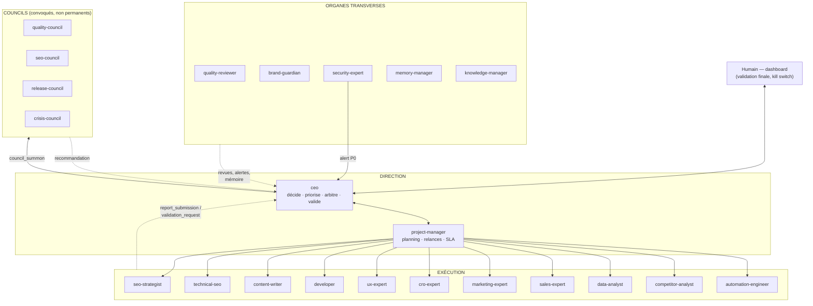
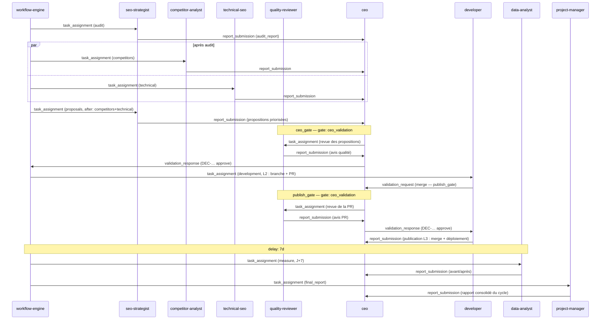

# 04 — Interactions entre les agents

> Qui parle à qui, avec quels messages, dans quel ordre. Ce document applique
> les schémas de [07-schemas.md](07-schemas.md) (notamment `AgentMessage` et
> l'enum `MessageType`) au roster défini dans
> [03-agents/README.md](03-agents/README.md), sur l'architecture de
> [01-architecture.md](01-architecture.md).

---

## 1. Principes de communication

1. **Hub-and-spoke autour du CEO.** Topologie décisionnelle en étoile :
   l'humain parle au `ceo` (dashboard), le `ceo` assigne au `project-manager`
   et aux agents, les agents remontent au `ceo`. Seul le `ceo` produit des
   `Decision` ([07-schemas.md §5](07-schemas.md)).
2. **Jamais d'appel direct agent→agent.** Un agent ne peut pas invoquer le
   runtime d'un autre. Toute communication est un `AgentMessage`
   ([07-schemas.md §4](07-schemas.md)) déposé sur le bus, qui le route, le
   valide (Zod) et le journalise ; même un simple échange d'information passe
   par `info_request` / `info_response` routés (cf. §3.f).
3. **Types de messages fermés.** Seules les 10 valeurs de l'enum `MessageType`
   sont admises : `task_assignment`, `status_update`, `report_submission`,
   `validation_request`, `validation_response`, `info_request`,
   `info_response`, `escalation`, `alert`, `council_summon`. Tout autre type
   est rejeté à la frontière.
4. **Tout est journalisé** (principe P5) : chaque `MSG-…` part dans le journal
   d'audit append-only avec ses `refs` (`RPT-…`, `DEC-…`, `TSK-…`) — références
   par identifiant, jamais par copie de contenu. Un rapport se transmet par
   `report_submission` (ref `RPT-…`), une décision par `validation_response`
   (ref `DEC-…`).

---

## 2. Organigramme

Lecture : les flèches sont des flux d'`AgentMessage` sur le bus, pas des appels
directs. Le `project-manager` pilote l'exécution ; les organes transverses
interviennent sur tous les livrables ; les councils n'existent qu'une fois
convoqués par `council_summon`.

---

## 3. Chaînes de commandement et circuits types

Chaque circuit est décrit comme une séquence de messages `from → to : type`.

### a) Assignation de tâche

1. `ceo → project-manager : task_assignment` (payload : `TSK-…` créée par
   `ceo/src/task-dispatcher.ts`).
2. `project-manager → <agent> : task_assignment` (planification, deadline SLA).
3. `<agent> → project-manager : status_update` (`ack` puis `progress`, types
   `AgentResponse`, [07-schemas.md §3](07-schemas.md)).
4. `<agent> → ceo : report_submission` (refs : `RPT-…`) + `status_update` au
   `project-manager` ; la tâche passe à `done` après validation du rapport.

### b) Demande de validation L3

1. `<agent> → ceo : validation_request` (tâche en `awaiting_validation` ;
   payload : action L3 précise + `RPT-…` de contexte).
2. Revue préalable obligatoire selon le livrable (§6) : `quality-reviewer`
   et/ou `brand-guardian` déposent leur avis en `report_submission`.
3. `ceo → <agent> : validation_response` (refs : `DEC-…`, décision
   `approve` / `reject` / `revise` / `defer`, `conditions` éventuelles) ; sur
   `approve`, la tâche repart en `in_progress` pour exécuter l'action L3.

### c) Escalade humaine

Cas listés dans [01-architecture.md §5.3](01-architecture.md) : dépense
publicitaire, suppression de contenu publié, paiements Stripe, déploiement
hors fenêtre, dépassement de budget, conflit non résolu par un council.

1. `ceo → human:<user_id> : escalation` (file de validation du dashboard ;
   `Decision` intermédiaire `escalate_to_human`).
2. L'humain tranche → `Decision` avec `decided_by: "human:<user_id>"` ;
   `human:<user_id> → ceo : validation_response`, puis
   `ceo → <agent> : validation_response` (refs : `DEC-…`).

### d) Blocage et déblocage

1. `<agent> → project-manager : status_update` (réponse `blocked`, `needs[]` :
   `info` / `dependency` / `budget` / `validation`) ; la tâche passe à `blocked`.
2. Le `project-manager` traite en autonomie déléguée : relance, replanification,
   ou `info_request` vers l'agent détenteur de l'information.
3. Déblocage : `project-manager → <agent> : status_update` (besoin satisfait) ;
   la tâche repasse `in_progress`. S'il ne peut pas débloquer (arbitrage,
   budget) : `project-manager → ceo : escalation`.

### e) Alerte P0 sécurité

Autonomie déléguée du `security-expert` : l'alerte court-circuite la file,
jamais la validation.

1. `security-expert → ceo : alert` (`task_id: null`, payload : CVE/faille,
   sévérité, sites touchés).
2. `ceo → council:crisis-council : council_summon` + tâche P0 via le workflow
   `ops/incident-response.yaml`.
3. `ceo → developer : task_assignment` (correctif, L2 : branche + PR) et
   `ceo → project-manager : task_assignment` (coordination).
4. `developer → ceo : validation_request` (merge/déploiement L3) →
   `validation_response` — escaladée à l'humain si hors fenêtre autorisée.

### f) Demande d'information entre agents (routée, jamais directe)

Exemple : `content-writer` a besoin des mots-clés cibles du `seo-strategist`.

1. `content-writer → seo-strategist : info_request` — déposé sur le bus, routé
   et journalisé ; `task_id` obligatoire (contexte), TTL appliqué (cf. §9).
2. `seo-strategist → content-writer : info_response` (refs : `RPT-…` ou
   `MEM-…`). Sans réponse avant le TTL, le bus notifie le `project-manager`,
   qui relance (§9). L'information durable devient candidate à la mémoire
   (`MemoryRecord` → `memory-manager`).

---

## 4. Séquence complète du workflow `full-seo-cycle`

Conforme au YAML de [07-schemas.md §9](07-schemas.md)
(`workflows/definitions/seo/full-seo-cycle.yaml`). Les revues du
`quality-reviewer` devant les gates appliquent la règle de revue obligatoire
du §6.

`on_failure: escalate_to_ceo` : tout échec d'étape émet
`system → ceo : escalation` (refs : `WFR-…`, `TSK-…` en `failed`).

---

## 5. Les councils

Un council n'est **pas** un canal permanent : c'est une délibération ponctuelle
exécutée par `councils/src/council-runner.ts`, déclenchée par un
`council_summon` du `ceo` (destinataire `council:<slug>`). Compositions issues
de `councils/definitions/` ([02-arborescence.md](02-arborescence.md)) :

| Council | Composition (slugs) | Convoqué quand |
|---|---|---|
| `quality-council` | `quality-reviewer` + `brand-guardian` + agent concerné | Livrable contesté, désaccord sur un blocage qualité/marque |
| `seo-council` | `seo-strategist` + `technical-seo` + `competitor-analyst` | Choix stratégique SEO structurant (refonte de cocon, migration) |
| `release-council` | `developer` + `security-expert` + `quality-reviewer` | Release sensible : mise à jour majeure, dépendances critiques, hors fenêtre |
| `crisis-council` | `project-manager` + `security-expert` + `developer` | Incident P0 (cf. §3.e et `ops/incident-response.yaml`) |

**Protocole de délibération** (`councils/src/protocols.ts`) :

1. `ceo → council:<slug> : council_summon` (payload : question posée, refs).
2. Le council-runner sollicite chaque membre **indépendamment** (pas de
   contamination des avis) ; chacun rend un avis structuré référencé.
3. Synthèse (convergences, divergences, options pros/cons), puis
   `council:<slug> → ceo : report_submission` — une **recommandation**, pas
   une décision.
4. **Le CEO garde la décision** : `Decision` (`kind: "arbitration"`) avec
   `options_considered` reprenant la synthèse. Un conflit non résolu par un
   council est escaladé à l'humain (§3.c).

---

## 6. Revues obligatoires

Certains livrables passent **avant** la `validation_request` au CEO par un ou
deux réviseurs transverses. Le réviseur peut bloquer (autonomie déléguée,
[03-agents/README.md](03-agents/README.md)) ; seul le CEO débloque.

| Livrable | `quality-reviewer` | `brand-guardian` | `security-expert` |
|---|---|---|---|
| Article / contenu éditorial (brouillon CMS) | ✔ | ✔ | — |
| PR de code (avant merge) | ✔ | — | ✔ si sensible¹ |
| Campagne marketing (brief + créas) | ✔ | ✔ | — |
| Changement de prix / offre (Shopify) | ✔ | ✔ | — |
| Workflow n8n avant activation (L3) | ✔ | — | ✔ |
| Rapport client sortant (export) | ✔ | ✔ | — |
| Modification de balises / données structurées | ✔ | — | — |
| Documentation interne (`knowledge-manager`) | ✔ | — | — |

¹ « Sensible » : authentification, paiements, dépendances, credentials,
en-têtes de sécurité, upload de fichiers — sinon `quality-reviewer` seul.

Circuit type (article) : `content-writer → ceo : validation_request`
(publication L3) → le CEO assigne les deux revues en parallèle
(`task_assignment`) → chaque réviseur rend un `report_submission` → le CEO
décide (`validation_response`, refs : `DEC-…` + les deux `RPT-…`).

---

## 7. Arbitrage des conflits

**Cas concret** : le `seo-strategist` recommande un article agressif sur un
mot-clé comparatif (« X vs Y ») ; le `brand-guardian` bloque le brouillon —
ton non conforme et promesse interdite par les `editorial_preferences` du
client (`forbidden_topics`, cf. schéma `Client`).

1. `brand-guardian → ceo : report_submission` — `status_global: "red"`,
   constats sourcés (extraits du brouillon vs charte). Le blocage est posé
   (autonomie déléguée) ; la tâche du `content-writer` passe à `blocked`.
2. `seo-strategist → ceo : escalation` — il maintient sa recommandation
   (impact trafic estimé, preuves `competitor-analyst` à l'appui).
3. Le CEO constate un conflit bloquant entre deux organes légitimes :
   `ceo → council:quality-council : council_summon` (composition :
   `quality-reviewer` + `brand-guardian` + agent concerné, ici le
   `seo-strategist`).
4. Avis indépendants → synthèse : l'option « réécrire le contenu en comparatif
   factuel, sans superlatifs, avec sources » satisfait les deux contraintes.
5. `council:quality-council → ceo : report_submission` (recommandation).
6. `ceo` : `Decision` `kind: "arbitration"`, `decision: "revise"`, avec
   `conditions` (angle factuel, relecture `brand-guardian` avant publication) ;
   `ceo → content-writer : task_assignment` (révision du brief),
   `ceo → seo-strategist : validation_response`,
   `ceo → brand-guardian : status_update` (levée conditionnelle du blocage).
7. Si `validation_policy: "strict"` ou désaccord persistant :
   `ceo → human:<user_id> : escalation` (§3.c). La décision est mémorisée
   (`mem_decisions`) pour les arbitrages futurs.

---

## 8. Matrice d'interactions

Interlocuteurs principaux de chaque agent (hors CEO et PM, qui parlent à tous).

| Agent | Interlocuteurs principaux | Pourquoi |
|---|---|---|
| `ceo` | humain, `project-manager`, tous | Décisions, validations, arbitrages, escalades |
| `project-manager` | `ceo`, tous les exécutants | Assignations, relances, SLA, déblocages, rapport final |
| `seo-strategist` | `technical-seo`, `competitor-analyst`, `content-writer`, `data-analyst` | Audits croisés, briefs contenus, mesure d'impact |
| `technical-seo` | `seo-strategist`, `developer`, `data-analyst` | Constats techniques → correctifs → re-mesure (CWV) |
| `content-writer` | `seo-strategist`, `quality-reviewer`, `brand-guardian` | Briefs en entrée, double revue en sortie |
| `developer` | `technical-seo`, `security-expert`, `quality-reviewer`, `automation-engineer` | Implémente les constats, PR revues, release-council |
| `ux-expert` | `cro-expert`, `developer`, `data-analyst` | Parcours et accessibilité → hypothèses → implémentation |
| `cro-expert` | `ux-expert`, `data-analyst`, `developer`, `sales-expert` | Tunnel/panier, A/B tests, mesure avant/après |
| `marketing-expert` | `sales-expert`, `data-analyst`, `brand-guardian`, `content-writer` | Campagnes, messages, conformité de marque |
| `sales-expert` | `marketing-expert`, `cro-expert`, `data-analyst` | Offres, prix, panier moyen, réachat |
| `data-analyst` | tous les exécutants, `ceo` | Fournit le « avant/après » de tout le monde |
| `competitor-analyst` | `seo-strategist`, `marketing-expert`, `memory-manager` | Veille, benchmarks, alimentation de `mem_competitors` |
| `security-expert` | `developer`, `ceo` (alertes), `automation-engineer` | Propose, ne corrige jamais ; siège release/crisis-council |
| `automation-engineer` | `developer`, `project-manager`, `security-expert` | Workflows n8n, intégrations, revue avant activation L3 |
| `memory-manager` | tous (en réception), `knowledge-manager` | Reçoit les `MemoryRecord` candidats, écrit directement dans Qdrant ; avec le `knowledge-manager` qui, lui, écrit via le pipeline, ce sont les seuls à alimenter Qdrant |
| `quality-reviewer` | `content-writer`, `developer`, `marketing-expert`, `ceo` | Revue de tout livrable avant validation CEO |
| `brand-guardian` | `content-writer`, `marketing-expert`, `sales-expert`, `ceo` | Ton, style, promesses, interdits éditoriaux |
| `knowledge-manager` | `memory-manager`, `project-manager`, tous | Procédures, guides, référentiels transverses |

---

## 9. Règles anti-dérive

Appliquées par le bus de messages et le moteur de tâches (code, pas prompt) :

1. **TTL sur chaque message** : un `info_request` sans `info_response` avant
   son TTL (défaut : 4 h ouvrées, configurable par priorité) est marqué
   expiré ; le bus émet un `status_update` vers le `project-manager`.
2. **Compteur de rebonds** : chaque `AgentMessage` issu d'un autre message
   hérite d'un compteur incrémenté ; au-delà de 5 rebonds sur le même
   `task_id` sans changement d'état de la tâche, le bus coupe la chaîne et
   émet `system → ceo : escalation`. Aucune boucle infinie de
   question/réponse n'est possible.
3. **Pas de délégation en cascade non tracée** : un agent ne crée jamais de
   tâche pour un autre. Le `project-manager` ne crée pas directement de `Task` :
   il propose des plans de tâches que le task-dispatcher du `ceo` instancie.
   Seuls trois créateurs directs de `Task` existent — le `ceo`
   (task-dispatcher, `created_by: ceo`), le `workflow-engine`
   (`created_by: workflow:<id>`) et l'humain (`created_by: human:<id>`) ;
   `created_by` l'atteste. Un besoin d'aide s'exprime en `info_request` ou en
   `blocked` avec `needs[]` — jamais en sous-traitance silencieuse.
4. **Silence ⇒ relance PM ⇒ escalade CEO** : une tâche `in_progress` sans
   `status_update` pendant son intervalle de heartbeat déclenche une relance
   du `project-manager` (autonomie déléguée) ; deux relances sans réponse ⇒
   `project-manager → ceo : escalation` — le CEO réassigne ou déclenche le
   kill switch de l'agent.
5. **Dépassement de SLA** : `deadline` dépassée ⇒ vieillissement de priorité
   (P2 → P1, [01-architecture.md §7](01-architecture.md)) + `escalation`
   automatique du scheduler.
6. **Messages hors schéma** : tout `AgentMessage` invalide (type hors enum,
   destinataire inconnu, `refs` orphelines) est rejeté à la frontière et
   journalisé comme violation, comme un appel MCP hors matrice.

---

*Voir aussi : [05-flux-de-donnees.md](05-flux-de-donnees.md) (trajet des
données) et [03-agents/README.md](03-agents/README.md) (autonomies, matrice MCP).*
