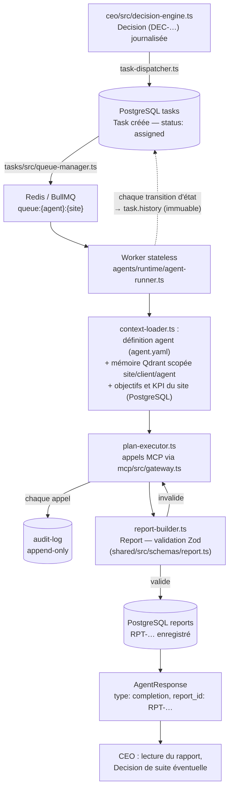
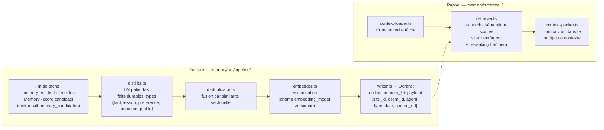
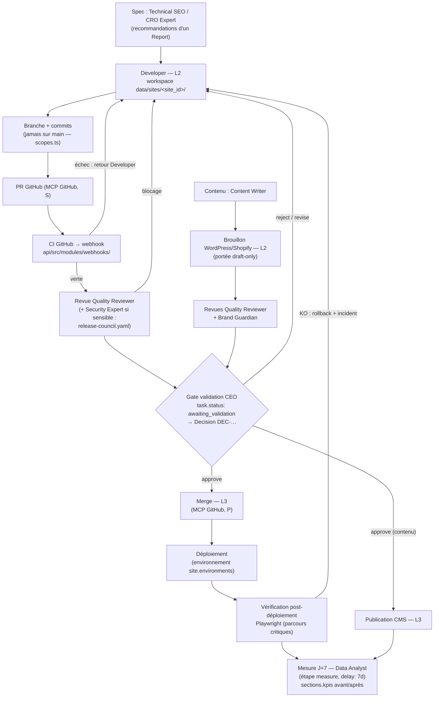

# 05 — Flux de données

> Ce document décrit où vivent les données et comment elles circulent entre les
> composants décrits dans [01-architecture.md](01-architecture.md), selon les
> schémas canoniques de [07-schemas.md](07-schemas.md) et l'arborescence de
> [02-arborescence.md](02-arborescence.md). Règle transverse : **une seule
> source de vérité par donnée**, toutes les références croisées se font par
> identifiant (`TSK-`, `RPT-`, `DEC-`, `MSG-`, `WFR-`, `MEM-`), jamais par copie
> de contenu.

---

## 1. Cartographie des stockages

| Stockage | Données | Pourquoi ce stockage | Source de vérité |
|----------|---------|----------------------|------------------|
| **PostgreSQL** (`database/schema/`) | Tâches (`tasks.ts`), sites (`sites.ts`), clients (`clients.ts`), rapports (`reports.ts`), décisions (`decisions.ts`), état des agents (`agents-state.ts`), journal d'audit (`audit-log.ts`), KPI (`kpis.ts`), concurrents (`competitors.ts`), mots-clés (`keywords.ts`), index mémoire (`memory-index.ts`) | Transactionnel, requêtable, partitionnable par `site_id` (P6), migrations versionnées | Oui — pour toute donnée structurée métier |
| **Qdrant** (8 collections, `memory/src/collections.ts`) | `mem_sites`, `mem_clients`, `mem_agents`, `mem_decisions`, `mem_seo_campaigns`, `mem_articles`, `mem_competitors`, `mem_keywords` — faits distillés (`MemoryRecord`), payload `{site_id, client_id, agent, type, date, source_ref}` | Recherche sémantique scopée + filtrage par payload | Oui — pour les souvenirs distillés (les `source_refs` pointent vers PostgreSQL) |
| **Redis** | Files BullMQ (`queue:{agent}:{site}`), verrous distribués, cache court terme (contexte de tâche en cours) | Volatil, rapide, priorités/retries natifs BullMQ | Non — tout ce qui compte est reconstructible depuis PostgreSQL |
| **Fichiers `data/`** | `data/sites/<site_id>/` (workspaces : clones Git, exports, captures), `data/clients/<client_id>/` (documents, briefs), `data/artifacts/` (audits Lighthouse, crawls, snapshots) | Artefacts volumineux inadaptés à la base ; référencés par chemin dans `result.artifacts` et `sections.annexes` | Oui — pour les artefacts binaires/volumineux |
| **Coffre à secrets** | Credentials par site/client, référencés par `credentials_ref` (ex. `vault://sites/site_acme-shop`) | Chiffrement, rotation, injection à l'exécution ; jamais en clair ni en base ni dans les prompts | Oui — pour les secrets |

Conséquences pratiques :

- Un `Report` ne recopie jamais un artefact : `sections.annexes` contient des
  chemins `data/artifacts/…`.
- Un `MemoryRecord` ne recopie jamais un rapport : `source_refs: ["RPT-…", "TSK-…"]`.
- Redis peut être vidé sans perte : les files se reconstruisent depuis les
  tâches `assigned` en PostgreSQL.

---

## 2. Flux 1 — Cycle de vie d'une tâche

Chemin nominal : décision CEO → exécution par un worker → rapport → retour CEO.



Détail des étapes et des écritures :

1. **Décision** — le CEO produit un `Decision` (`kind: "planning"` ou
   `prioritization`) écrit en append-only dans `decisions`, puis
   `ceo/src/task-dispatcher.ts` crée la `Task` (`created_by: "ceo"`, ou
   `workflow:<wfr_id>` si issue d'un workflow, `human:<user_id>` si humaine).
2. **File** — `tasks/src/queue-manager.ts` pousse un job dans
   `queue:{agent}:{site}` avec la priorité `P0`–`P3` ; la transition
   `draft → assigned` est ajoutée à `history` (jamais réécrit).
3. **Contexte** — `agents/runtime/context-loader.ts` assemble : la définition
   `agents/definitions/<slug>/agent.yaml`, le prompt
   `prompts/agents/<slug>/system.md`, la mémoire Qdrant filtrée par
   `{site_id, client_id, agent}` (voir Flux 2), les objectifs/KPI du site.
4. **Exécution** — chaque appel MCP passe par `mcp/src/gateway.ts`
   (allowlist `permission-matrix.ts`, portées `scopes.ts`, quotas
   `quotas.ts`) et alimente `task.logs`
   (`{ at, level, event: "mcp_call", detail }`) et le journal d'audit.
5. **Rapport** — `report-builder.ts` impose le format unique ; la validation
   Zod (`shared/src/schemas/report.ts`) rejette tout écart et renvoie la tâche
   en révision (P4). Le rapport validé est écrit dans `reports`, et
   `task.result` est rempli : `{ summary, report_id, artifacts, memory_candidates }`.
6. **Remontée** — l'agent émet un `AgentResponse` (`type: "completion"`,
   `report_id` obligatoire ; ou `blocked` / `validation_request` avec `needs[]`).
   Si une action L3 est en jeu, la tâche passe en `awaiting_validation` et le
   bloc `task.validation` est renseigné (`decided_by`, `decision_id` → `DEC-…`).
7. **Historisation** — chaque transition
   (`assigned → in_progress → … → done | failed`) est un événement
   `{ at, from, to, by, reason }` ajouté à `history` ; les coûts sont accumulés
   dans `task.cost` (`llm_tokens`, `mcp_calls`, `usd_estimate`).

---

## 3. Flux 2 — Pipeline mémoire

Écriture (fin de tâche) puis lecture (rappel au début d'une tâche suivante).
Le Memory Manager est le **seul** agent en écriture directe sur Qdrant.



Points structurants :

- **Candidats** : tout agent peut proposer des souvenirs, mais uniquement sous
  forme de `MemoryRecord` candidats listés dans `result.memory_candidates` ;
  aucune écriture directe (matrice MCP : seul Memory Manager a `Qdrant RW`).
- **Distillation** : `distiller.ts` utilise le palier `fast` (Memory Manager)
  et les prompts de `prompts/pipeline/` ; les faits gardent `source_refs`
  (`RPT-…`, `TSK-…`), `confidence` et `valid_until` (null = durable).
- **Rappel** : la recherche est toujours filtrée par le payload
  (`site_id`/`client_id`/`agent`) — un site ne voit jamais la mémoire d'un
  autre (P6) — puis re-classée par fraîcheur ; `context-packer.ts` tronque au
  budget de contexte défini par `guardrails.ts`.
- **Ré-indexation** : `embedding_model` est stocké dans chaque point. Lors d'un
  changement de modèle d'embeddings, un job de fond (Memory Manager) relit les
  `MemoryRecord` dont `embedding_model` diffère de la config courante,
  re-vectorise le `content` via `embedder.ts` et réécrit le point — sans
  toucher au contenu ni aux `source_refs`. L'index PostgreSQL
  (`database/schema/memory-index.ts`) permet d'itérer sans scan complet de Qdrant.

---

## 4. Flux 3 — Ingestion analytics

Sources externes → snapshots KPI historisés → détection d'anomalies → CEO.

```
GSC / GA4 / Google Ads / Stripe
  → connecteurs MCP en lecture seule (mcp/src/servers/gsc.ts, ga4.ts, google-ads.ts, stripe.ts)
  → snapshots périodiques déclenchés par tasks/src/scheduler.ts (tâches récurrentes par site)
  → écriture dans la table kpis (database/schema/kpis.ts) : {site_id, name, value, at}
  → détection d'anomalies (Data Analyst : seuils, tendances, ruptures)
  → AgentMessage type "alert" → CEO (Decision éventuelle : création de tâche corrective)
```

- **Fraîcheur** : chaque snapshot est horodaté ; le tableau de bord affiche
  l'âge de la donnée. Fréquences types : GA4/GSC quotidien, Stripe quotidien,
  Google Ads quotidien (lecture seule — toute écriture Ads est L3).
- **Historisation** : la table `kpis` est append-only par période — on ne met
  jamais à jour une valeur passée, on ajoute un nouveau point. C'est ce qui
  alimente les blocs `sections.kpis` des rapports
  (`{ name, before, after, target, trend }`) : le « avant/après » est calculé
  en requêtant deux fenêtres temporelles.
- **Seuils** : un franchissement de seuil peut aussi déclencher un workflow
  (`workflows/src/triggers.ts`, `trigger.kind: kpi_threshold`).

---

## 5. Flux 4 — Publication et déploiement

Deux chemins : le chemin **code** (Git/CI) et le chemin **CMS** (brouillons).
Dans les deux cas, la production (L3) est derrière une validation CEO (P2).



Précisions :

- Le workspace `data/sites/<site_id>/` est la seule zone `Filesystem RW` du
  Developer (note ¹ de la matrice MCP) ; le clone Git du site y vit.
- Le webhook CI (`api/src/modules/webhooks/`) met à jour la tâche
  (`task.logs`) et débloque ou renvoie la tâche selon le statut.
- Le gate correspond au `gate: ceo_validation` des workflows
  (`workflows/src/validation-gates.ts`) ; l'approbation produit un `Decision`
  (`decision: "approve"`, `conditions` éventuelles, ex. « déployer hors heures
  de pointe ») référencé dans `task.validation.decision_id`.
- Si `client.validation_policy: "strict"`, le gate exige en plus une validation
  humaine (`decided_by: "human:<user_id>"`).
- La vérification post-déploiement (Playwright) et la mesure J+7 ferment la
  boucle : leurs preuves vont dans `data/artifacts/` et `sections.kpis`.

---

## 6. Flux 5 — Reporting

```
Report individuel (format unique, par tâche)
  → reports/src/report-service.ts (enregistrement, liaison task/site/client)
  → reports/src/aggregator.ts :
      · agrégat hebdomadaire par site   (workflow ops/weekly-report.yaml)
      · agrégat mensuel par client      (tous les sites du client)
  → frontend/src/app/reports/ (consultation, comparaison avant/après)
  → reports/src/exporters/ (Markdown, PDF) → n8n (envoi e-mail au client)
```

- Les agrégats sont eux-mêmes des `Report` (produits par le Project Manager) :
  `period` renseigné, `status_global` synthétique (pire statut des rapports
  sources), `sections.annexes` référençant les `RPT-…` sources par identifiant.
- L'export e-mail passe par n8n (webhook sortant), jamais par un agent
  directement : l'Automation Engineer maintient le workflow n8n, son activation
  est L3.

---

## 7. Flux 6 — Audit et gouvernance

- **Tout appel MCP** → `mcp/src/audit-log.ts` → table `audit-log` (append-only) :
  agent, `task_id`, serveur, méthode, args résumés, résultat, durée. Les
  tentatives hors matrice sont rejetées **et** journalisées comme violations.
- **Toute décision** → un `Decision` immuable dans `decisions`, avec
  `context_refs` (ce qui a été lu : `RPT-…`, `MSG-…`, `MEM-…`),
  `options_considered`, `rationale` toujours rempli.
- **Corrélation** : chaque événement (log de tâche, appel MCP, message,
  décision) porte le `task_id` ; les traces OpenTelemetry
  (`infra/observability/`) sont attribuées par tâche — on reconstruit le film
  complet d'une tâche depuis n'importe quelle entrée.
- **Coûts** : chaque appel LLM et MCP incrémente `task.cost`
  (`llm_tokens`, `mcp_calls`, `usd_estimate`) ; les agrégations par
  agent/site/mois alimentent les quotas (`mcp/src/quotas.ts`) et la politique
  de coûts : alerte à 80 % du budget (`client.budget.llm_monthly_usd`), gel à
  100 % avec escalade humaine.

---

## 8. Flux 7 — Secrets

```
Coffre (credentials_ref: vault://sites/<site_id>)
  → mcp/src/credentials-broker.ts
  → injection à l'exécution dans le connecteur MCP concerné (mcp/src/servers/*)
```

- Les agents ne voient **jamais** un secret : ni dans le contexte LLM, ni dans
  les prompts, ni dans `task.logs`, ni dans l'audit (les args y sont résumés et
  filtrés). Le broker injecte le credential côté passerelle, au moment de
  l'appel, pour le site concerné uniquement.
- PostgreSQL ne stocke que la **référence** (`credentials_ref`), jamais la valeur.
- **Rotation** : la rotation d'un secret se fait dans le coffre sans toucher au
  reste du système (la référence est stable) ; toute utilisation d'un
  credential est corrélable via l'audit (agent, site, `task_id`, horodatage).

---

## 9. Rétention et volumes

Ordres de grandeur (hypothèse : ~10 tâches/site/jour en régime établi) :

| Donnée | 100 sites | 1000 sites | Notes |
|--------|-----------|------------|-------|
| Tâches / jour | ~1 000 | ~10 000 | lignes `tasks` + `history` (quelques Ko/tâche) |
| Appels MCP / jour (audit) | ~20 000 | ~200 000 | ~30 appels/tâche en moyenne ; c'est le flux le plus volumineux |
| Vecteurs Qdrant (stock) | ~10⁵–10⁶ | ~10⁶–10⁷ | quelques faits distillés par tâche, après déduplication |
| Snapshots KPI / jour | ~2 000 | ~20 000 | ~20 KPI/site/jour, append-only |
| Artefacts `data/` | ~Go/mois | ~dizaines de Go/mois | Lighthouse, crawls, captures |

Politiques de rétention — principe : on jette le **brut**, on garde le
**distillé** et l'**agrégé** :

| Donnée | Rétention | Ensuite |
|--------|-----------|---------|
| `task.logs`, traces OTel, logs bruts | 90 jours | purge (le journal d'audit et `history` suffisent) |
| Journal d'audit (`audit-log`) | 12 mois en base | archivage froid (export objet compressé), jamais supprimé |
| Tâches, rapports, décisions | illimitée | partitionnement PostgreSQL par site/date à 1000 sites |
| KPI bruts (`kpis`) | 24 mois au grain fin | ré-agrégation hebdo/mensuelle, conservation illimitée des agrégats |
| Faits Qdrant | illimitée avec hygiène | purge des `valid_until` échus, déduplication continue, décote de fraîcheur au rappel |
| Artefacts `data/artifacts/` | 6 mois | archivage objet froid ; les rapports gardent les chemins (liens morts assumés au-delà) |
| Workspaces `data/sites/<site_id>/` | vie du site | re-clonables ; nettoyés à l'archivage du site (`status: archived`) |

Le passage 100 → 1000 sites ne change aucun flux : mêmes composants,
partitions PostgreSQL, sharding Qdrant, réplicas de workers supplémentaires (P7).
